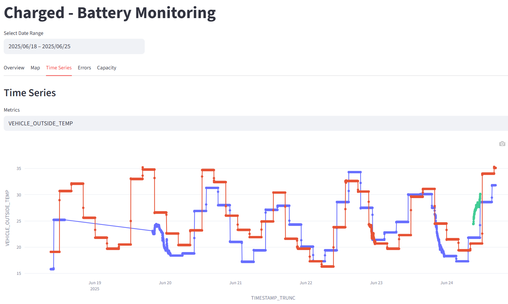

# Charged

Challenge 9: **Monitoring and management of railway vehicle batteries**.

The transition to battery-powered vehicles in the railway sector is essential for meeting net-zero climate targets, but it presents unique challenges in battery management and monitoring.

- **Transition to Net-Zero**: Replace diesel-powered vehicles with battery-powered alternatives to meet climate targets.
- **Increased Battery Use**: Anticipate a surge in diverse batteries across various vehicles and suppliers.
- **High-Costs**: Large capacity batteries are costly and new to the railway sector, necessitating careful monitoring.
- **Need for Standardization**: Address the lack of standardized analysis methods and error warning systems for effective battery management.

<p align="center">
  
</p>

## Background

<p align="center">
  
</p>

This project has been initiated during the [Hack4Rail 2025](https://hack4rail.event.sbb.ch/en/), a joint hackathon organised by the railway companies SBB, ÖBB, and DB in partnership with the OpenRail Association.

## Install

Install virtual environment for Python:

```bash
make
```

Create `.env` and update according to the documentation to enable database connection.


Start dashboard:

```bash
# load data from database to local parquet file.
uv run python dashboard/preprocess_data.py
# run stramlit dashboard
uv run streamlit run dashboard/main.py
```

## License

<!-- If you decide for another license, please change it here, and exchange the LICENSE file -->

The content of this repository is licensed under the [Apache 2.0 license](LICENSE).
