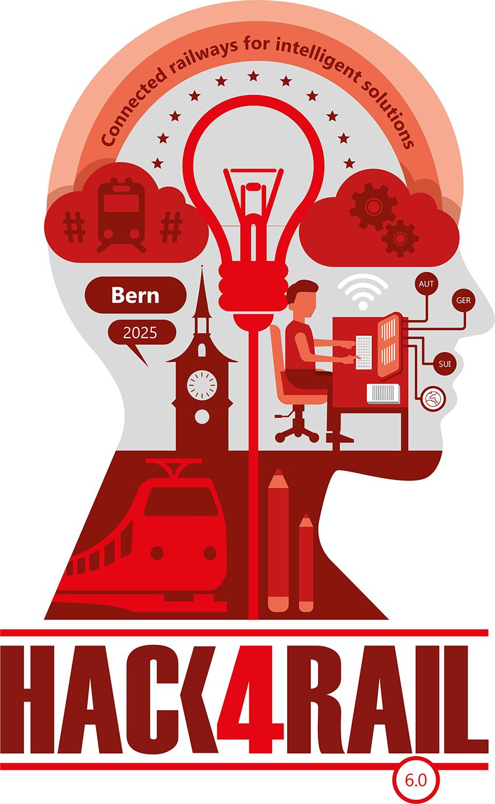

# Charged

Hack4Rail 2025

Challenge 9: Monitoring and management of railway vehicle batteries.

## Background

<p align="center">
  
</p>

This project has been initiated during the [Hack4Rail 2025](https://hack4rail.event.sbb.ch/en/), a joint hackathon organised by the railway companies SBB, ÖBB, and DB in partnership with the OpenRail Association.

## Install

Install virtual environment for Python using `uv`.

```bash
make
```

Create `.env` and update according to the documentation to enable connection to Snowflake database.


Start dashboard:

```bash
# load data
uv run python dashboard/preprocess_data.py
# start dashboard
uv run streamlit run dashboard/main.py
```

## License

<!-- If you decide for another license, please change it here, and exchange the LICENSE file -->

The content of this repository is licensed under the [Apache 2.0 license](LICENSE).
